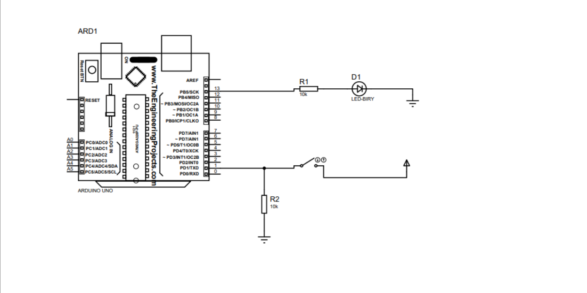
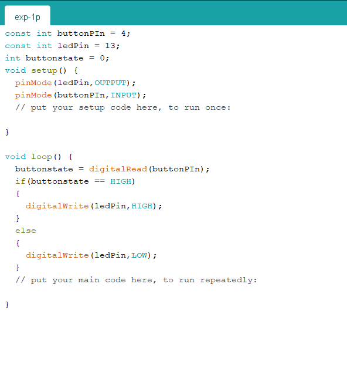

# Led-control-using-Arduino

## AIM
To design and implement a system for LED control using an Arduino microcontroller and a push button.

## COMPONENTS REQUIRED
Arduino  
Led  
Resistance  
Push button  
Bread board  
Jumber wire  

## PROCEDURE
Step 1 Connect all the componets as per the circut diagram  
Step 2 Open the Arduino IDE  
Step 3 Go to file and select the new file option  
Step 4 Type the program  
Step 5 Go to file and select save option to save the program  
Step 6 GO to sketch and select verify to compile the program  
Step 7 If no error, Connect the Arduino board to your computer using a USB cable  
Step 8 Select the correct board and port in the Arduino IDE  
Step 8 GO to sketch and select verify to upload the program in the Arduino board  
Step 9 Press the push button and observe the LED's behavior  

## THEORY

### Introduction 

LED pushbutton code is a program written for the Arduino UNO microcontroller that controls an LED using a pushbutton. When the pushbutton is pressed, the code reads the state of the button and turns the LED on or off accordingly.

### Arduino 
Arduino Uno. It is a microcontroller board developed by Arduino.cc and is based on Atmega328 Microcontroller.The software used for writing, compiling & uploading code to Arduino boards is called Arduino IDE.Arduino UNO is a very valuable addition in electronics that consists of a USB interface, 14 digital I/O pins(of which 6 Pins are used for PWM), 6 analog pins and an Atmega328 microcontroller. It also supports 3 communication protocols named Serial, I2C and SPI protocol.It has an operating voltage of 5V while the input voltage may vary from 7V to 12V.Arduino UNO has a maximum current rating of 40mA, so the load shouldn't exceed this current rating or you may harm the board.It comes with a crystal oscillator of 16MHz, which is its operating frequency.It also has 1 Reset Pin, which is used to reset the board programmatically. In order to reset the board, we need to make this pin LOW.It also has 6 Power Pins, which provide different voltage levels.Arduino UNO comes with 3 types of memories associated with it, named Flash Memory: 32KB,SRAM: 2KB,EEPROM: 1KB.Pin 2 and 3 are used for providing external interrupts. An interrupt is called by providing LOW or changing value.Arduino Uno comes with a built-in LED which is connected through pin 13. Providing HIGH value to the pin will turn it ON and LOW will turn it OFF.

### Push button
Push button switches or push switches are small lever-like devices used to create or break an electronic circuit. It is also used to control actions in machines that ruin electronics. In simple words, push button switches are used to run or stop electrical appliances or circuits.Connecting a push button with an Arduino is very simple. Connect one terminal of the push button to the ground pin and another terminal to any Arduino digital pins. Here you have to use a pull-up resistor (10k Ω) to keep the voltage HIGH when you are not pressing the button.
The pullup resistor is nothing but a high-value resistor connecting to the Arduino digital pin you are using with the HIGH (5v) voltage.

### Led
LED is a semiconductor light source. It consists of a PN Junction Diode and when voltage is applied to the LED, electrons and holes recombine in the PN Junction and release energy in the form of light (Photons).The light emitted by an LED is usually monochromatic i.e. of single color and the color is dependent on the energy band gap of the semiconductor.Light Emitting Diodes can be manufactured to emit all the wavelengths of visible spectrum i.e. from Red (620nm to 750nm) to blue – violet (380nm to 490nm).The electrical symbol of an LED is similar to that of a PN Junction Diode

### Working 
In the setup function, the pin mode for the LED and pushbutton pins are set using the pinMode function. The pin mode for the LED pin is set to OUTPUT, and the pin mode for the pushbutton pin is set to INPUT.In the loop function, the state of the pushbutton is read using the digitalRead function. If the pushbutton is pressed (HIGH state), the LED is turned on using the digitalWrite function. If the pushbutton is not pressed (LOW state), the LED is turned off. This process is repeated continuously, with the state of the pushbutton and the state of the LED being continuously checked and updated.

### Applications
Interactive Light Display  
Educational Game for Children  
Home Automation  
Security System Indicator  
Emergency Signaling System  
Weighing Machines  

## CIRCUIT DIAGRAM

## PROGRAM

## OUTPUT

LED OFF

 
 
 

LED ON

## RESULT

Thus, the program is successfully executed.